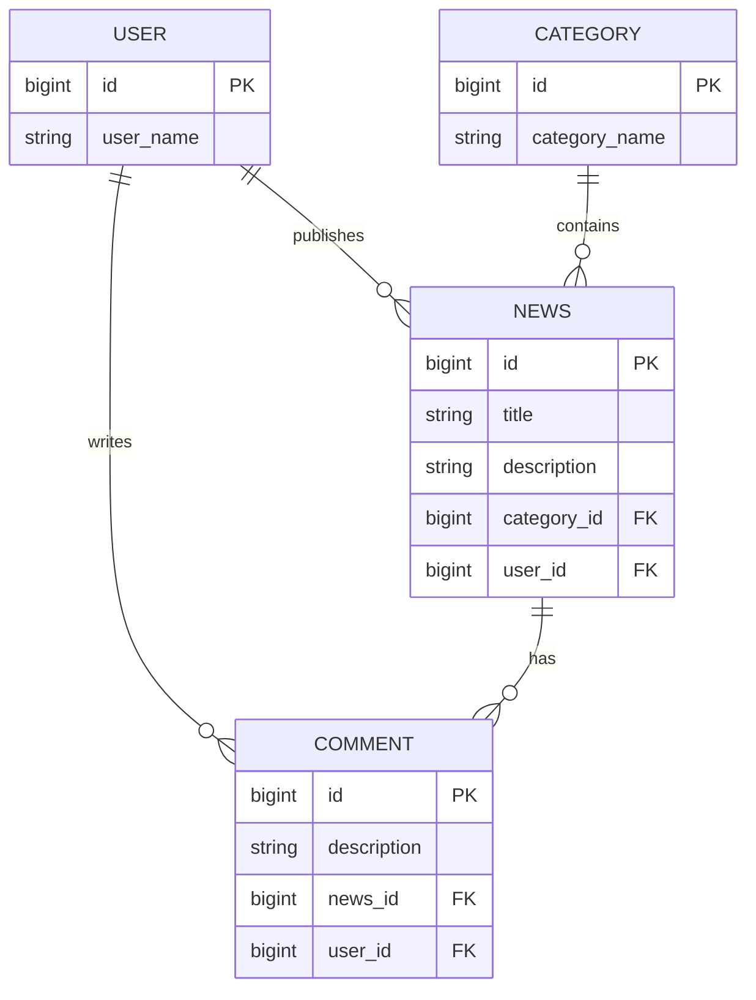

# 📰 News Portal API

**News Portal** — это современный RESTful API сервис для платформы "добрых и веселых новостей". Проект разработан на стеке Spring Boot 3 с использованием Java 21 и демонстрирует применение лучших практик промышленной разработки.

[](https://github.com/davletchurin/news-portal/actions)


---

## 🚀 Основные возможности (Features)

* **Content Management:** Полный CRUD для пользователей, новостей, категорий и комментариев.
* **Advanced Filtering:** Использование **Spring Data Specifications** для гибкой фильтрации новостей (по авторам/категориям) и комментариев.
* **Performance:** Оптимизация запросов через **EntityGraph** (решение проблемы N+1).
* **Pagination:** Все списки поддерживают пагинацию для эффективной работы с большими объемами данных.
* **Validation & Global Error Handling:** Строгая валидация входящих данных (Jakarta Validation) и централизованная обработка исключений через `@ControllerAdvice`.
* **Modern Mapping:** Использование **MapStruct** для быстрого и типобезопасного преобразования Entity <-> DTO.

---

## 🛠 Технологический стек

* **Runtime:** Java 21, Spring Boot 3.5
* **Database:** PostgreSQL, Spring Data JPA
* **Mapping & Tools:** MapStruct 1.6, Lombok
* **API Docs:** SpringDoc OpenAPI (Swagger UI)
* **CI/CD:** GitHub Actions (автоматическая сборка проекта)
* **Deployment:** Docker, Multi-stage Dockerfile, Docker Compose

---

## 🏗 Архитектура и база данных

Проект следует слоистой архитектуре (Controller -> Service -> Repository). Связи между сущностями визуализированы ниже:



---

## 🚦 Инструкция по запуску

### Запуск через Docker (Рекомендуется)
Для полной сборки и запуска приложения вместе с базой данных выполните:
```bash
docker compose up --build
```

### Запуск для разработки (IDE)
1. Поднимите базу данных:
   ```bash
   docker-compose -f docker-compose.db.yml up
   ```
2. Запустите приложение:
   ```bash
   ./gradlew bootRun
   ```

---

## 📖 Документация API

После запуска API доступно через Swagger UI:
👉 **[http://localhost:8080/swagger-ui/index.html](http://localhost:8080/swagger-ui/index.html)**

---

## 🗺 Дорожная карта (Roadmap)
- [x] Настройка CI/CD (GitHub Actions).
- [x] Dockerization (Multi-stage build).
- [ ] Внедрение **Liquibase** для управления миграциями БД.
- [ ] Реализация **Spring Security + JWT** (авторизация и аутентификация).
- [ ] Покрытие кода тестами (**JUnit 5, Mockito, Testcontainers**).
- [ ] Добавление Soft Delete для новостей и комментариев.

---
*Проект разработан в учебных целях для демонстрации навыков владения современным Java-стеком.*